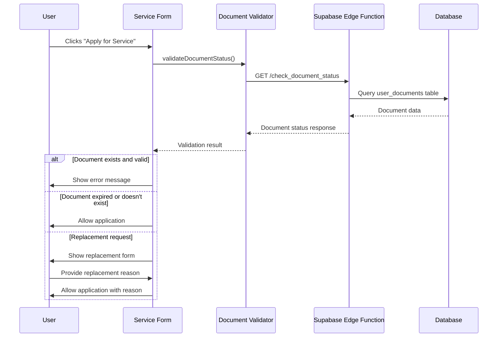

# Document Validation System Implementation Guide

## Overview

This document provides a comprehensive guide for the Document Validation System implemented for the MoI Platform. The system prevents users from applying for documents they already possess while providing a smooth experience for legitimate replacement requests.

## Architecture

### Components Implemented

1. **TypeScript Interfaces** (`src/types/documentValidation.ts`)
2. **Supabase Edge Function** (`supabase/functions/check_document_status/index.ts`)
3. **Document Validation Service** (`src/services/documentValidation.ts`)
4. **UI Components** (`src/components/services/ReplacementReasonSection.tsx`)
5. **Form Integration** (Updated `ServiceForm.tsx` and `ServiceApplicationDialog.tsx`)

## System Flow



## Implementation Details

### 1. Document Status Checking

The system uses a Supabase Edge Function that:
- Accepts `userId` (national number) and `documentType` (service ID or document type)
- Maps service IDs to document types (1=passport, 2=national_id, etc.)
- Queries the `user_documents` table for active documents
- Returns structured response with existence and expiry information

### 2. Validation Logic

The validation service implements these scenarios:

| Scenario | Document Exists | Document Expired | Is Replacement | Action |
|----------|----------------|------------------|----------------|---------|
| 1 | No | N/A | N/A | ✅ Allow |
| 2 | Yes | Yes | N/A | ✅ Allow |
| 3 | Yes | No | No | ❌ Block |
| 4 | Yes | No | Yes | ✅ Allow with reason |

### 3. User Interface

The system provides:
- **Replacement Toggle**: Switch to enable replacement mode
- **Replacement Type Selection**: Radio buttons for Lost/Damaged/Stolen
- **Additional Details**: Text area for extra information
- **Validation Feedback**: Real-time error/warning messages
- **Form Integration**: Seamless integration with existing service forms

## Usage Examples

### Basic Document Validation

```typescript
import { validateDocumentStatus } from '@/services/documentValidation';

const result = await validateDocumentStatus({
  userId: user.nationalNumber,
  serviceId: 1 // Passport service
});

if (!result.canProceed) {
  // Show error and block application
  toast({
    title: "Cannot Proceed",
    description: result.errorMessage,
    variant: "destructive"
  });
  return;
}

// Proceed with application
```

### Replacement Request Handling

```typescript
const result = await validateDocumentStatus({
  userId: user.nationalNumber,
  serviceId: 1,
  isReplacement: true,
  replacementReason: "Replacement request - Lost: Document was lost during travel"
});

if (result.canProceed && result.isReplacementAllowed) {
  // Submit application with replacement reason
  await submitApplication({
    ...applicationData,
    emergency_reason: replacementReason
  });
}
```

### Form Integration

```typescript
// In ServiceApplicationDialog.tsx
const handleSubmit = async (e: React.FormEvent) => {
  e.preventDefault();
  
  // Step 1: Validate document status
  const validationResult = await validateDocumentStatus({
    userId: user.nationalNumber,
    serviceId: parseInt(formData.serviceType),
    isReplacement: formData.isReplacement,
    replacementReason: formData.isReplacement ? createReplacementReasonString(
      formData.replacementType,
      formData.replacementDetails
    ) : undefined
  });

  // Step 2: Handle validation result
  if (!validationResult.canProceed) {
    setValidationError(validationResult.errorMessage);
    return;
  }

  // Step 3: Submit application
  await submitToDatabase();
};
```

## API Reference

### validateDocumentStatus Function

```typescript
function validateDocumentStatus(params: DocumentValidationParams): Promise<DocumentValidationResult>
```

**Parameters:**
- `userId: string` - User's national number
- `serviceId: number` - Service ID (1-4)
- `isReplacement?: boolean` - Whether this is a replacement request
- `replacementReason?: string` - Reason for replacement (required if isReplacement = true)

**Returns:**
- `canProceed: boolean` - Whether user can proceed with application
- `errorMessage?: string` - Error message to display (if canProceed = false)
- `warningMessage?: string` - Warning message (non-blocking)
- `documentInfo?: object` - Existing document information
- `isReplacementAllowed?: boolean` - Whether this passed due to replacement

### Supabase Edge Function

**Endpoint:** `GET /functions/v1/check_document_status`

**Query Parameters:**
- `userId` - User's national number
- `documentType` - Service ID (1-4) or document type string

**Response:**
```json
{
  "exists": true,
  "expired": false,
  "expiryDate": "2026-05-01",
  "documentId": "123",
  "documentStatus": "active",
  "documentNumber": "PP-123456-789012",
  "issueDate": "2021-05-01"
}
```

## Service ID to Document Type Mapping

| Service ID | Document Type | Display Name |
|------------|---------------|--------------|
| 1 | passport | Passport |
| 2 | national_id | National ID |
| 3 | birth_certificate | Birth Certificate |
| 4 | driver_license | Driver License |

## Error Handling

The system handles various error scenarios:

1. **Network Errors**: "Unable to verify document status due to network issues"
2. **API Errors**: "Unable to verify document status. Please try again later"
3. **Invalid Service ID**: "Invalid service selected. Please refresh the page"
4. **Missing User ID**: "User information is missing. Please log out and log back in"
5. **Document Exists**: "You already have a valid [Document]. You cannot apply until it expires"

## Deployment Instructions

### 1. Deploy Supabase Edge Function

```bash
# Navigate to your Supabase project
supabase functions deploy check_document_status

# Set environment variables
supabase secrets set SUPABASE_URL=your_supabase_url
supabase secrets set SUPABASE_SERVICE_ROLE_KEY=your_service_role_key
```

### 2. Update Frontend Dependencies

Ensure these UI components are available:
- `@/components/ui/switch`
- `@/components/ui/radio-group`
- `@/components/ui/textarea`
- `@/components/ui/alert`

### 3. Test the Integration

1. **Test Document Validation**:
   - Create a test user with an active document
   - Try to apply for the same document type
   - Verify the error message appears

2. **Test Replacement Flow**:
   - Enable replacement mode
   - Select replacement reason
   - Verify application proceeds with reason captured

3. **Test Edge Cases**:
   - Network disconnection during validation
   - Invalid service IDs
   - Missing user information

## Customization Options

### Adding New Document Types

1. Update `SERVICE_TO_DOCUMENT_TYPE` mapping in `src/types/documentValidation.ts`
2. Add new document type to database enum
3. Update `DOCUMENT_TYPE_NAMES` for display names

### Modifying Validation Logic

The validation logic is centralized in `processDocumentValidation()` function in `src/services/documentValidation.ts`. Modify this function to change validation behavior.

### Customizing UI Messages

Update `VALIDATION_ERROR_MESSAGES` in `src/types/documentValidation.ts` to customize error messages.

## Security Considerations

1. **Authentication**: The Edge Function uses Supabase RLS (Row Level Security)
2. **Input Validation**: All inputs are validated before database queries
3. **Error Handling**: Sensitive information is not exposed in error messages
4. **Rate Limiting**: Consider implementing rate limiting for the Edge Function

## Performance Considerations

1. **Caching**: Consider caching document status for short periods
2. **Database Indexing**: Ensure proper indexes on `user_documents` table
3. **Edge Function Optimization**: The function is optimized for single queries

## Troubleshooting

### Common Issues

1. **"Cannot find module" errors**: Ensure all imports are correct and files exist
2. **Edge Function not responding**: Check Supabase logs and environment variables
3. **Validation always fails**: Verify service ID mapping and database data
4. **UI components not rendering**: Check if all required UI components are installed

### Debug Mode

Enable debug logging by adding console.log statements in the validation service:

```typescript
// In validateDocumentStatus function
console.log('Validation params:', params);
console.log('API response:', documentStatus);
console.log('Validation result:', result);
```

## Future Enhancements

1. **Batch Validation**: Support validating multiple document types at once
2. **Offline Support**: Cache validation results for offline scenarios
3. **Advanced Replacement Types**: Add more specific replacement categories
4. **Document History**: Track replacement history and prevent abuse
5. **Integration with External APIs**: Validate against government databases

## Support

For issues or questions regarding this implementation:

1. Check the troubleshooting section above
2. Review the console logs for detailed error information
3. Verify all components are properly imported and configured
4. Test with different user scenarios to isolate the issue

---

**Implementation Date**: January 2025  
**Version**: 1.0  
**Author**: Document Validation System Implementation